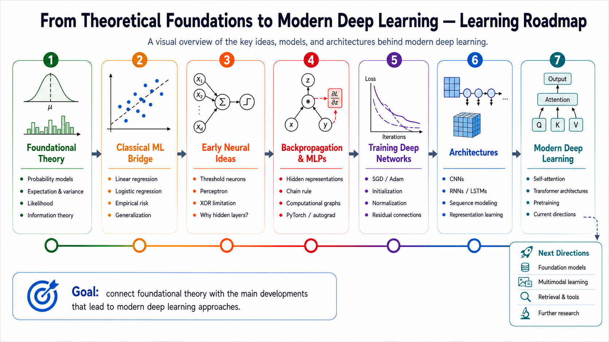

# Deep Learning from Foundations

A structured learning portfolio documenting my progress from probability foundations to modern deep-learning architectures.

This repository combines mathematical derivations, conceptual explanations, numerical examples, and small NumPy or PyTorch implementations. It is intended to preserve both the material I study and the development of my understanding over time.

## Learning Map

The following map summarizes the high-level learning path of this repository, from mathematical foundations in probability toward modern deep-learning architectures.



## Learning Path

The current learning path is organized into the following chapters:

1. [Probability Foundations](chapters/01-probability-foundations/)
2. [Further Probability Topics Related to Machine Learning](chapters/02-further-probability-topics/)
3. [Machine Learning Basics](chapters/03-machine-learning-basics/)
4. [Deep Networks](chapters/04-deep-networks/)
5. [Regularization](chapters/05-regularization/)
6. [Optimization for Training Deep Models](chapters/06-optimization-for-training-deep-models/)
7. [Convolutional Networks](chapters/07-convolutional-networks/)
8. [Sequence Modeling: Recurrent and Recursive Nets](chapters/08-sequence-modeling/)
9. [Autoencoders](chapters/09-autoencoders/)
10. [Representation Learning](chapters/10-representation-learning/)
11. [Transformers](chapters/11-transformers/)

The learning path may evolve as new topics are added or the relationships between topics become clearer.

## Repository Structure

```text
deep-learning-from-foundations/
├── chapters/
│   ├── 01-probability-foundations/
│   ├── 02-further-probability-topics/
│   ├── 03-machine-learning-basics/
│   ├── 04-deep-networks/
│   ├── 05-regularization/
│   ├── 06-optimization-for-training-deep-models/
│   ├── 07-convolutional-networks/
│   ├── 08-sequence-modeling/
│   ├── 09-autoencoders/
│   ├── 10-representation-learning/
│   └── 11-transformers/
├── learning-roadmap/
├── resources/
├── templates/
├── LICENSE
└── README.md
```

Each chapter contains topic-specific learning materials. A typical completed topic directory may include:

```text
topic-name/
├── README.md
└── topic-name.ipynb
```

The topic `README.md` provides a concise overview and navigation guide, while the notebook contains the substantive learning material: explanations, derivations, examples, code, observations, corrections, and follow-up questions.

## How to Read This Repository

This repository is organized as a learning record rather than a textbook.

For each topic, start with the topic `README.md` when available. It gives the topic scope, main takeaways, and the recommended notebook to open. Then read the notebook for the full technical development.

The notebooks may include:

- definitions and notation;
- mathematical derivations;
- conceptual explanations;
- small numerical examples;
- NumPy or PyTorch implementations;
- observations from experiments or simulations;
- misconceptions corrected during the learning process;
- unresolved questions for later study.

## Learning Approach

The materials in this repository aim to connect:

- intuition and formal definitions;
- probability and mathematical foundations;
- equations and tensor dimensions;
- algorithms and implementations;
- theoretical results and numerical experiments;
- initial misconceptions and corrected understanding.

The repository is not intended to present a fully polished final view of every topic. It is a structured record of an evolving learning process, organized so that each session remains technically accurate, readable, and easy to revisit.

## Resources

References, textbooks, courses, videos, and supplementary materials used throughout the project are documented in the [`resources`](resources/) directory and within individual learning sessions where appropriate.

Copyrighted source materials are not included unless redistribution is permitted.

## License

Original notes and code in this repository are released under the [MIT License](LICENSE).
